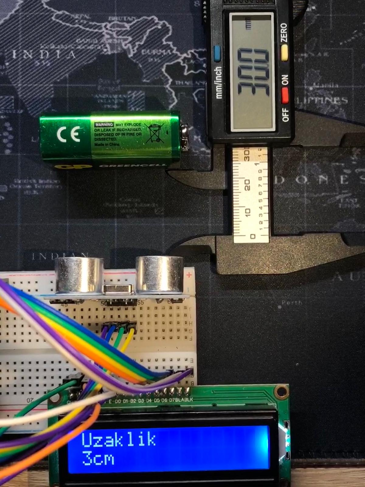

# Arduino-ile-Dijital-Metre-Yapimi
Bu proje, Arduino Uno kullanarak bir dijital metre yapımını amaçlar. HC-SR04 ultrasonik sensör, mesafeyi ölçer ve bu ölçüm, bağlı olan LCD ekranda santimetre cinsinden görüntülenir. Bu sayede, kullanıcılar anlık olarak mesafeyi görebilirler.
## Kullanılan Malzemeler;
- Arduino Uno  
- HC-SR04 Ultrasonik Sensör  
- 16x2 LCD Ekran  
- Potansiyometre  
- Jumper Kablo  
- Breadboard  


[](video.mp4)

### Ölçüm Doğruluğu Testi



### Kodlar;

```cpp

#include <LiquidCrystal.h>

int trigPin = 7;
int echoPin = 6;
int sure;
int uzaklik;
#define led

int rs = 12, en = 11, d4 = 5, d5 = 4, d6 = 3, d7 = 2;
LiquidCrystal lcd(rs, en, d4, d5, d6, d7);

void setup() {
  pinMode(trigPin, OUTPUT);
  pinMode(echoPin, INPUT);
  lcd.begin(16,2);

}

void loop() {

  digitalWrite(trigPin, LOW);
  delayMicroseconds(5);
  digitalWrite(trigPin, HIGH);
  delayMicroseconds(10);
  digitalWrite(trigPin, LOW);
  sure = pulseIn(echoPin, HIGH, 11600),
  
  uzaklik = sure*0.0345/2;

  delay(250);

  lcd.clear();
  lcd.setCursor(0,0);
  lcd.print("Uzaklik");
  lcd.setCursor(0,1);
  lcd.print(uzaklik);
  lcd.print("cm");


}

```
